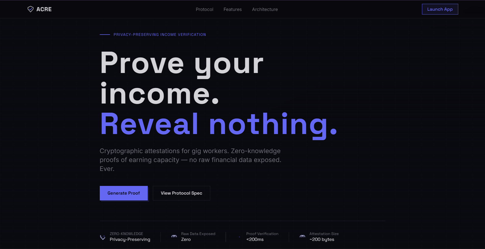
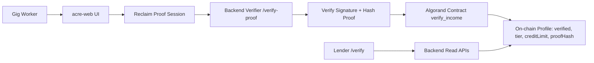

# acre-web

> Privacy-preserving income verification for gig workers, built on Algorand.

[](https://acre-web-three.vercel.app/)

[](https://algorand.com)
[](https://noir-lang.org)
[](https://algobharat.in)
[](https://algobharat.in)

Acre enables gig workers to prove loan eligibility without exposing raw income history.
The app combines Reclaim-based proof collection, backend verification, and Algorand on-chain attestation so lenders can verify eligibility with privacy preserved.



## ✨ Why Acre

Traditional underwriting excludes many gig workers because they lack salary slips and payroll records. Acre replaces invasive document sharing with a cryptographic eligibility signal that lenders can trust while users keep detailed financial history private.

## 🚀 Quick Start (most important section)

```bash
cd acre-web
npm install
npm run dev
```

App runs at `http://localhost:8080`.

Minimum local setup:

```bash
VITE_RECLAIM_APP_ID=
VITE_RECLAIM_APP_SECRET=
VITE_RECLAIM_PROVIDER_ID=
VITE_BACKEND_VERIFY_URL=http://localhost:3001/verify-proof
VITE_ALGORAND_APP_ID=
VITE_ALGOD_SERVER=https://testnet-api.algonode.cloud
# Optional
VITE_ALGOD_TOKEN=
```

## Features

- Pera wallet integration for wallet-bound verification flows.
- Reclaim QR session flow for proof generation.
- Opt-in check and opt-in transaction handling for Algorand app access.
- Backend proof verification (`Reclaim.verifyProof`) + deterministic proof hashing.
- On-chain write path via `verify_income` for tier/credit-limit attestation.
- Lender verification terminal for address-based eligibility checks.
- Dashboard modules for proof status, profile, and protocol stats.
- Admin/verifier API support (including verifier rotation endpoint).

## How It Works (with diagram)



## Screenshots


## Tech Stack

- React 18 + TypeScript + Vite
- Tailwind CSS + shadcn/ui + Radix UI + Framer Motion
- React Router + React Query
- Algorand SDK + Pera Wallet Connect
- Reclaim JS SDK
- Vitest + Testing Library

## Project Structure

```text
acre-web/
├── public/
├── src/
│   ├── components/
│   ├── contexts/
│   ├── hooks/
│   ├── lib/                  # reclaim.ts, api.ts, algorand.ts
│   ├── pages/                # /, /launch, /dashboard, /generate, /verify
│   └── test/
├── .env
├── package.json
├── vite.config.ts
└── vitest.config.ts
```

## Environment Variables

| Variable | Required | Description |
|---|---|---|
| `VITE_RECLAIM_APP_ID` | Yes | Reclaim app ID |
| `VITE_RECLAIM_APP_SECRET` | Yes | Reclaim secret |
| `VITE_RECLAIM_PROVIDER_ID` | Yes | Reclaim provider ID |
| `VITE_BACKEND_VERIFY_URL` | Yes | Backend verify endpoint |
| `VITE_ALGORAND_APP_ID` | Yes | Target Algorand app ID |
| `VITE_ALGOD_SERVER` | Yes | Algod RPC URL |
| `VITE_ALGOD_TOKEN` | No | Algod token (if required) |

## Deployment

Production: https://acre-web-three.vercel.app/

Vercel settings:

- Build command: `npm run build`
- Output directory: `dist`
- Add all required `VITE_*` environment variables

## API Endpoints

Used by frontend (`VITE_BACKEND_VERIFY_URL` base):

- `POST /verify-proof`
- `GET /api/proof-count`
- `GET /api/admin`
- `GET /api/verifier`
- `GET /api/user/:address/eligibility`
- `GET /api/user/:address/verified`
- `GET /api/user/:address/tier`
- `GET /api/user/:address/credit-limit`
- `GET /api/user/:address/full-profile`
- `GET /api/user/:address/proof-hash`
- `POST /api/update-verifier`

## Contributing + License

Contributions are welcome via issues and PRs.

Add your preferred license file (`LICENSE`) for distribution clarity.
