# Acre — Visual Walkthrough

---

## Lender Flow: Configure & Monitor

### 1. Lender Overview

Get started with Acre as an NBFC or fintech. See your gig-worker portfolio at a glance.

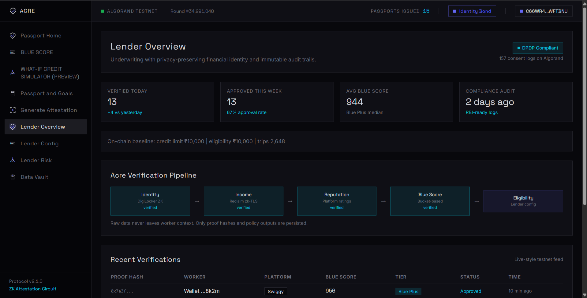

---

### 2. Lender Configuration Console

Configure your own scorecard. Select which proof modules matter (income, tenure, rating, identity). Set point buckets. Adjust thresholds. See portfolio impact before deploying.

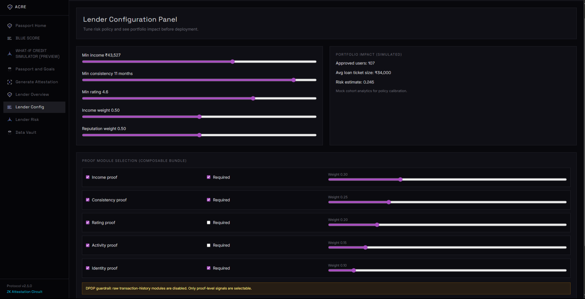

---

### 3. Lender Dashboard

Monitor all verified workers. Track approval rates, default rates, and lending volume in real-time.

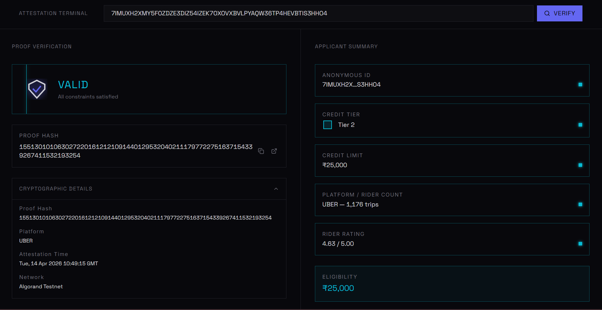

---

### 4. Lender Risk Management

View risk metrics by tier. Understand your gig-worker portfolio composition and expected default rates.

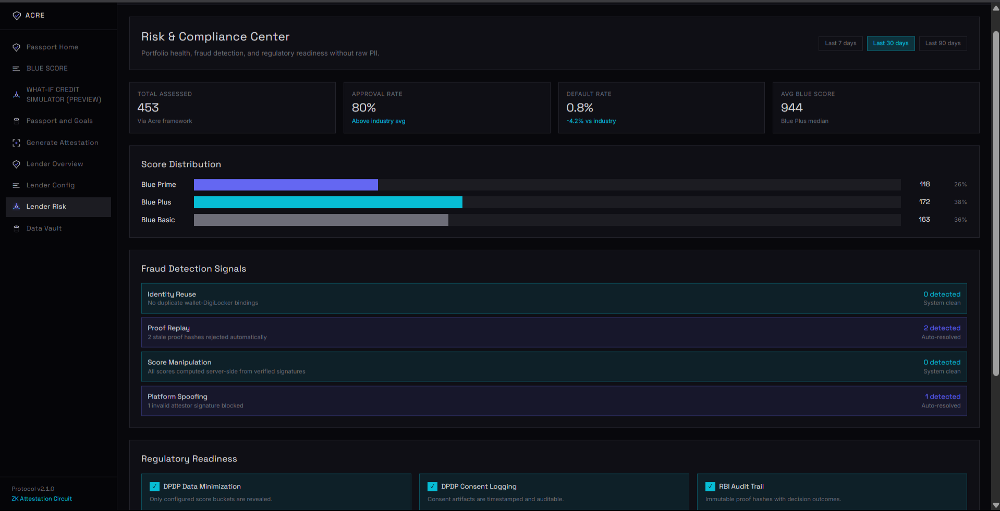

---

## Worker Flow: Prove & Unlock Credit

### 1. Identity Verification

Start by verifying your identity. Simple, secure, privacy-preserving.

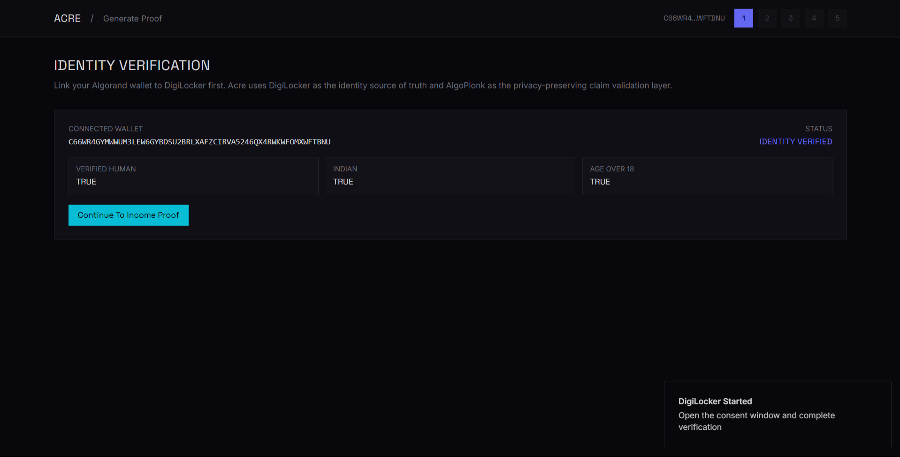

---

### 2. Passport & Financial Goals

Set your financial goals. Tell Acre what you want to achieve (working capital, education, asset purchase).

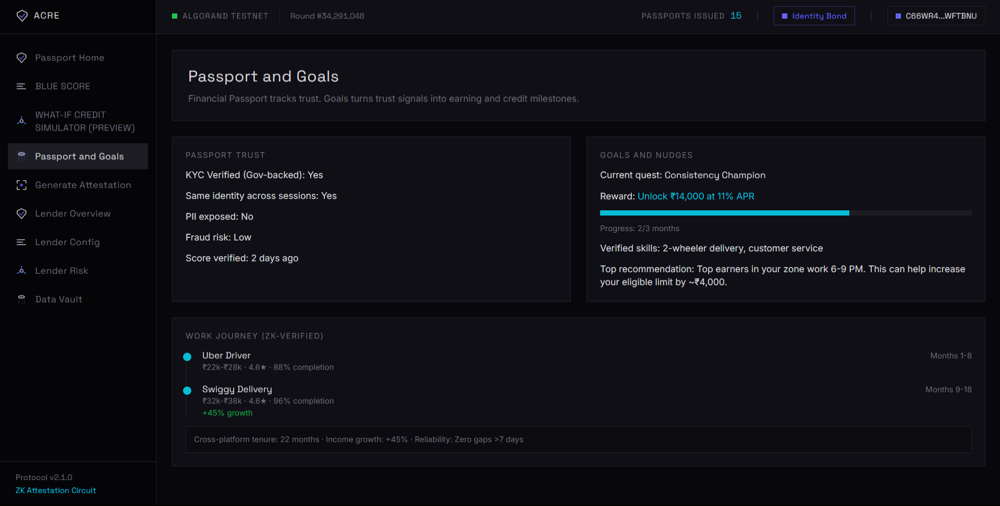

---

### 3. Scan Reclaim QR

Connect your earnings source. Scan the Reclaim QR code with your phone to authorize income verification from Uber, Swiggy, or other platforms.

---

### 4. Uber Connected

Successfully connected to your earnings source. Reclaim securely retrieves your income and tenure data via zk-TLS.

---

### 5. Proof Generation in Progress

ZK proof is being generated locally on your device. Your raw transaction data never leaves your phone.

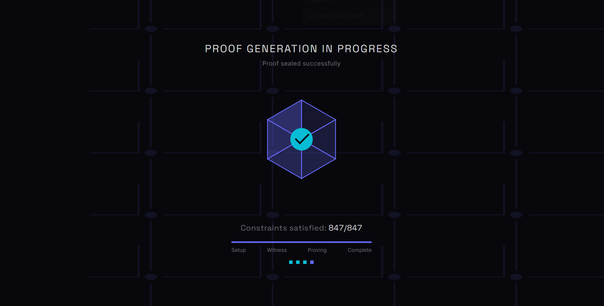

---

### 6. Proof Successfully Generated

Your ZK proof is ready. Your cryptographic proof of income, consistency, and reputation is now on Algorand.

---

### 7. User Dashboard

View your verified profile. See your Blue Score, eligibility tier, and credit limits from connected lenders.

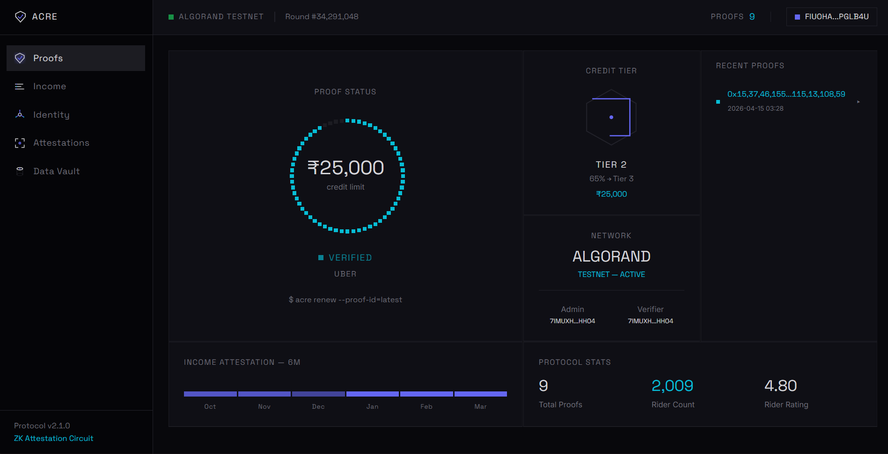

---

### 8. What-If Credit Simulator

Simulate your financial future. See how income growth, consistency improvements, and higher ratings unlock better credit tiers and lower APRs.

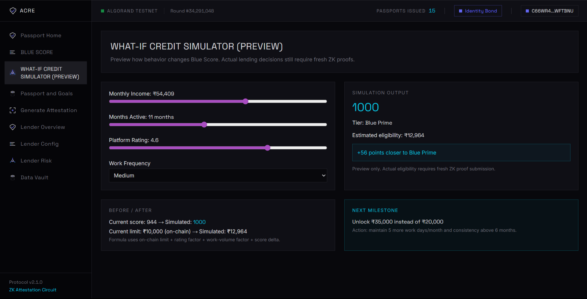

---

## Key Features & Architecture

### 1. Acre Product Features

Core capabilities overview. Multimodal input, non-custodial execution, atomic groups, cloud agent, persistence.

---

### 2. Blue Scorecard

Explainable credit scoring based on four dimensions: income, consistency, rating, and activity. See exactly how you earned each point.

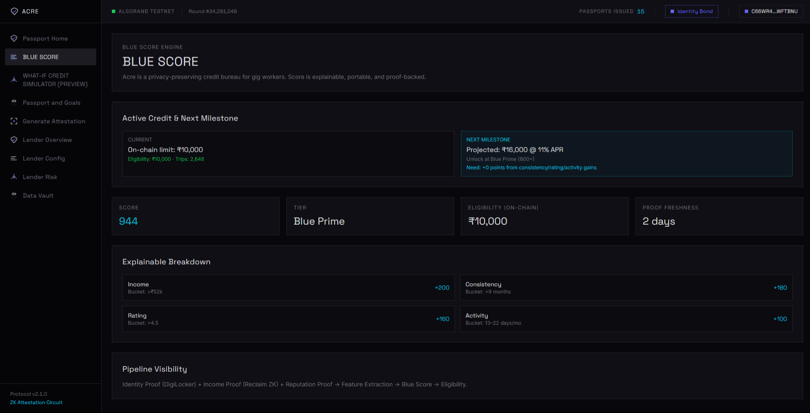

---

### 3. How Acre Works

End-to-end flow: describe goals → review workflow → sign with wallet → prove on Algorand.

---

### 4. Proof Generation Workspace

Visual builder for creating proof workflows. Drag, drop, configure. Or use natural language to describe your needs.

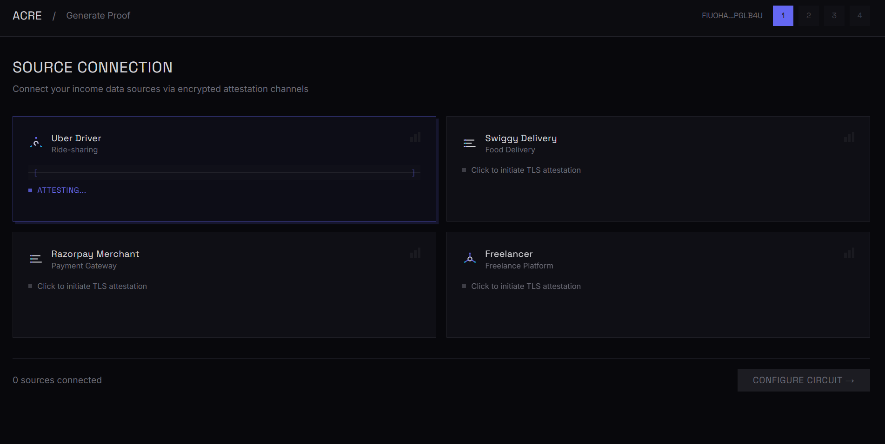

---

## Getting Started

### For Lenders

1. **Visit Lender Overview** — See your integration options
2. **Configure Scorecard** — Select proof modules, set thresholds
3. **Monitor Dashboard** — Track workers, approvals, defaults
4. **Manage Risk** — Adjust policies based on performance

### For Gig Workers

1. **Verify Identity** — Simple KYC
2. **Set Goals** — What do you want to achieve?
3. **Connect Earnings** — Scan Reclaim QR to Uber/Swiggy
4. **Review Score** — See your Blue Score and eligibility
5. **Simulate Future** — What-If Simulator shows how to improve
6. **Share with Lenders** — Connect with NBFCs for credit

---

  <strong>Acre: Lenders configure. Workers prove. Everybody wins.</strong>

